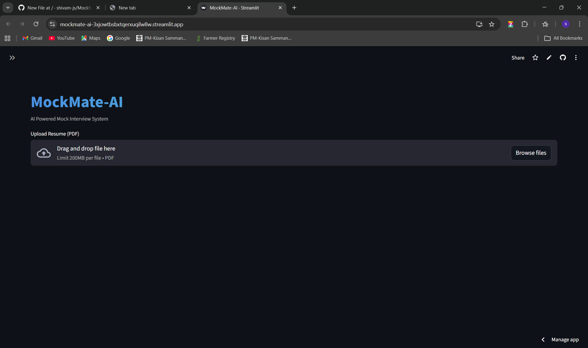
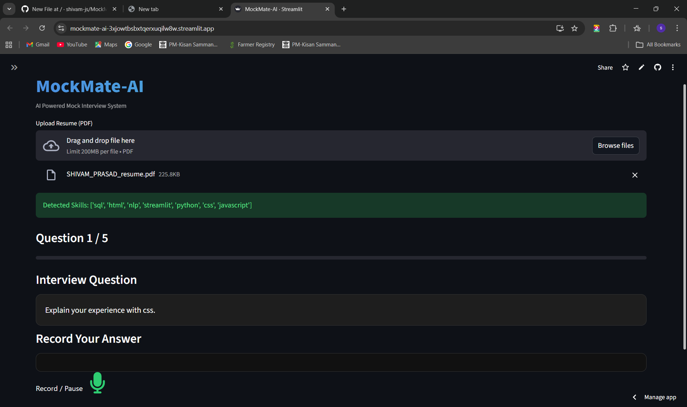
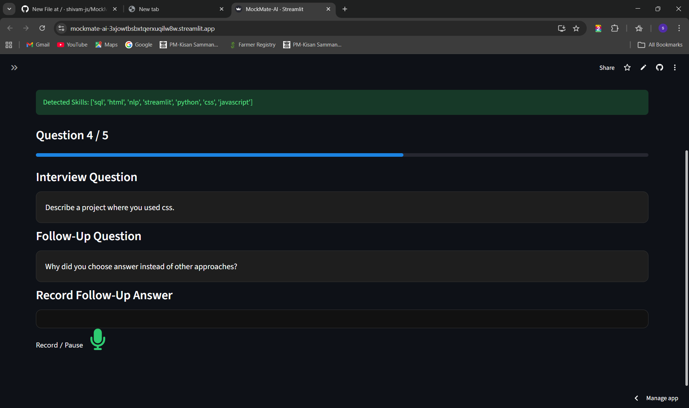
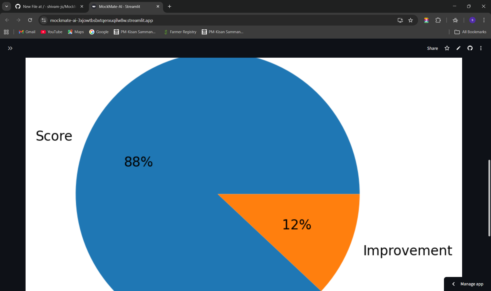
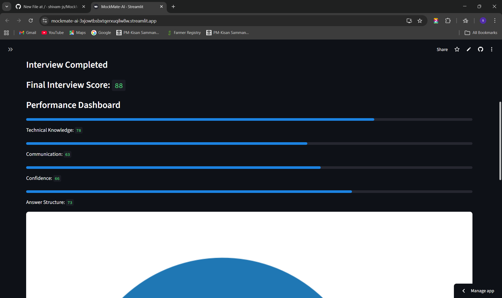

# MockMate-AI 🤖

AI-powered mock interview system that analyzes resumes, generates interview questions, records answers, and evaluates candidate performance.

## 🔗 Live Demo

https://mockmate-ai-3xjowtbsbxtqerxuqilw8w.streamlit.app/

---

## Screenshots

### Home Page

### Resume Upload

### Interview Page

### Evaluation Page

### Result Page

## 🚀 Features

• Resume Parsing from PDF
• Automatic Skill Extraction using NLP
• AI Generated Interview Questions
• Dynamic Follow-Up Questions
• Voice Answer Recording
• Interview Evaluation System

---

## 🛠 Tech Stack

Frontend
• Streamlit

Backend
• Python

AI / NLP
• TF-IDF
• Cosine Similarity
• NLP Skill Extraction

Libraries
• Streamlit
• Scikit-learn
• PyPDF2
• Matplotlib

---

## 📂 Project Structure

MockMate-AI
│
├── core
│   ├── resume_parser.py
│   ├── skill_extractor.py
│   ├── question_engine.py
│   ├── followup_engine.py
│   ├── voice_engine.py
│   └── evaluator.py

├── ui
│   └── components.py

├── app.py
└── requirements.txt

---

## ⚙️ How to Run Locally

git clone https://github.com/shivam-js/MockMate-AI

cd MockMate-AI

pip install -r requirements.txt

streamlit run app.py

---

## 👨‍💻 Author

Shivam Prasad

